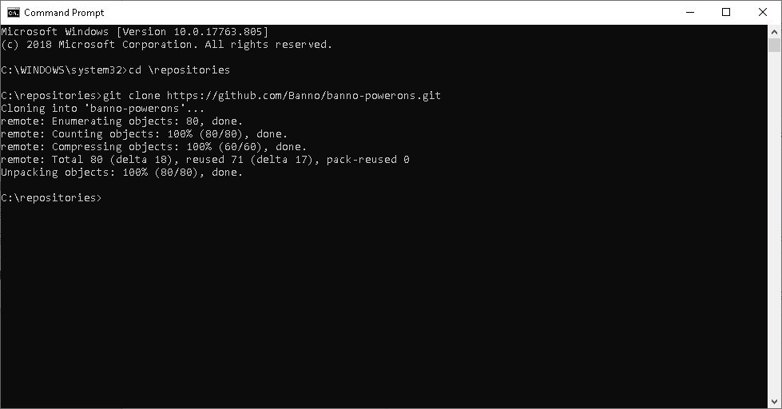

# Banno PowerOns

This is a repository for development of Banno PowerOns

## How To Install PowerOns For Use By Banno

1. Clone this repository

1.1 You need to install Git - you can do that from [here](https://git-scm.com/)

1.2 Create a folder where you want to store your cloned repository

1.3 Use the `Clone or download` button on the repository and copy the URL. Make sure you're using HTTPS.

1.4 Open a command prompt and navigate to the new folder. Type `git clone` and paste the URL you copied. You should have the cloned repository after executing this command.

2. Transfer the PowerOn and the associated configuration file

2.1 Open Episys Quest and Navigate to the PC Transfer screen

2.2 On the local panel navigate to the repository that you cloned. Then navigate to the `REPWRITERSPECS` folder of the PowerOn that you want to install.

2.3 On the host panel navigate to the `PowerOn Specfiles` folder. Make sure that Text mode is selected. Drag the .POW file from your local to your host panel.

2.4 On the local panel navigate back to the previous folder and then to the `LETTERSPECS` folder. On the host panel navigate to the previous, and then to the `Letter Files` folder. Drag the .CFG file from your local to your host panel. Make sure that Text mode is selected for this transfer.

3. Install the PowerOn for on-demand use

3.1 Navigate to the PowerOn Control screen.

3.2 Open the new PowerOn that you just transferred

3.3 Click the `Install a Specfile for Demand Use` button or press the F8 key

3.4 Click `Yes` to confirm. You should see a `Specfile: <name of your PowerOn> installed successfully!` message at the bottom.

4. Refresh SymXchange

4.1 In Episys Quest navigate to the `Device Control` screen. Select `SymXchange` in the device dropdown.

4.2 Select your sym's BANNO SymXchange instance and click `Refresh`. After the refresh is complete you should see a status `Done`.

That's it - your new PowerOn is installed on the Episys Host and it's ready to use by Banno!
