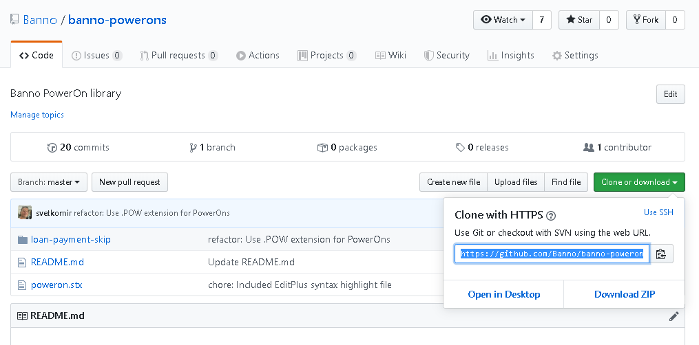

# Banno PowerOns

This is a repository for development of Banno PowerOns

## How To Install PowerOns For Use By Banno

### Download the repository files

1. Download the repository zip file

2. Extract the zip file into a folder of your choice

### Transfer the PowerOn and the associated configuration file

1. Open Episys Quest and Navigate to the PC Transfer screen

2. On the local panel navigate to the repository folder where you extracted the zip file. Then navigate to the `REPWRITERSPECS` folder of the PowerOn that you want to install.

3. On the host panel navigate to the `PowerOn Specfiles` folder. Make sure that Text mode is selected. Drag the .POW file from your local to your host panel.

4. On the local panel navigate back to the previous folder and then to the `LETTERSPECS` folder. On the host panel navigate to the previous, and then to the `Letter Files` folder. Drag the .CFG file from your local to your host panel. Make sure that Text mode is selected for this transfer.

### Install the PowerOn for on-demand use

1. Navigate to the PowerOn Control screen.

2. Open the new PowerOn that you just transferred

3. Click the `Install a Specfile for Demand Use` button or press the F8 key

4. Click `Yes` to confirm. You should see a `Specfile: <name of your PowerOn> installed successfully!` message at the bottom.

### Add the PowerOn to the SymXchange common parameters

1. Navigate the the Parameter Manager screen.

2. Select SymXchange Parameters in the dropdown

3. Expand your sym's Banno SymXchange instance and select `Common` under it (should be the first one)

3. Find the next available `Custom Specfile` slot and enter your PowerOn's name in it. You will get a warning that this might adversely affect services - this specific change will not interrupt any services.

5. Ensure the Specfile Load Method is set to "Individual" 

7. Click the `OK` button to confirm the changes.

### Refresh SymXchange

1. In Episys Quest navigate to the `Device Control` screen. Select `SymXchange` in the device dropdown.

2. Select your sym's BANNO SymXchange instance and click `Refresh`. After the refresh is complete you should see a status `Done`.

That's it - your new PowerOn is installed on the Episys Host and it's ready to use by Banno!
